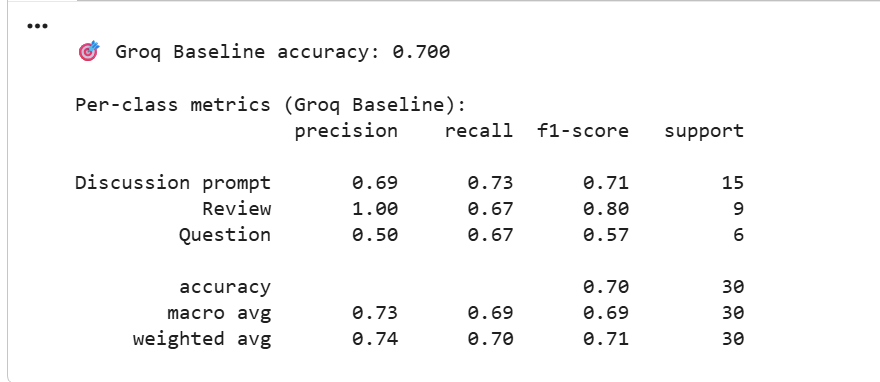
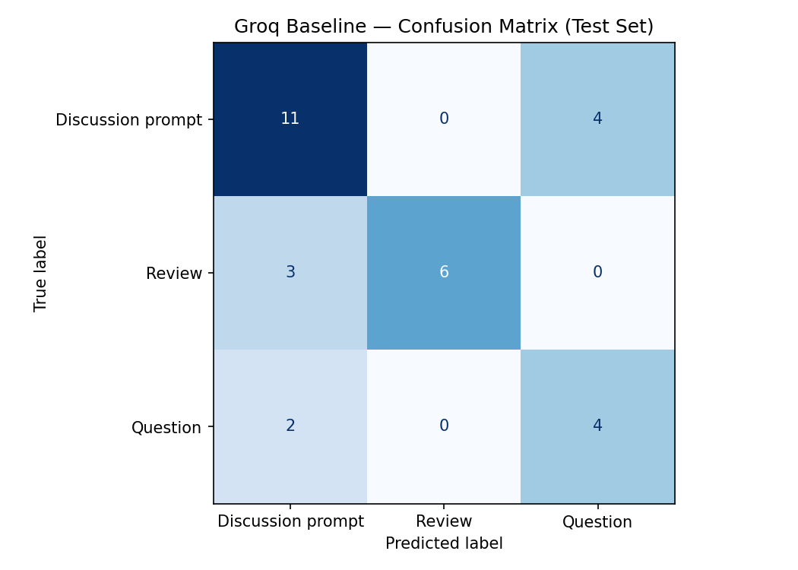

# ai201-project3-takemeter

Which labels are being confused? -> The model is mainly confusing discussion prompts for questions. There are also some review prompts being confused for discussion prompts. 

Why is that boundary hard? -> that boundary is hard because the posts for discussion prompts and questions tend to be extremely similar. They both end up giving context and asking a question the difference comes in the intent and the content of the response. Since they are so similarly strucutred it could be difficult to differentiate between the two. 

Is this a labeling problem or a prompt/data problem? -> Quite frankly, this is a problem with the labeling. I feel that possibly the question and disucssion prompt labels are so closely related that having one prompt for both would make more sense. Using mutliple labels is redunant which leads to the model confusing them so much. 

What would need to change to fix it? -> The biggest change would be either combining the two labels into one so that the model is less confused or changing the intention behind one of the labels such that it is more definied. However, I think that combining them would be best. 

Sample Classifications:

1. Text:      Do you listen to certain types of music during certain times of the year?
Obviously, some genres have a very suitable time of year during which to listen (e.g., reggae during summer), but are there an...
True:      Discussion prompt
Predicted: Discussion prompt (confidence: 1.00) -> Analysis: This is correct because this prompt is asking for peoples opinions and experiences which would not have a definitive answer and it is not a review of something.

2. Text:      The Smurfs and Futurism in the early 80s
Get ready for an incredibly niche topic.

I was listening to a compilation earlier today and on it was the 1983 song “Salsa Smurph” by Special Request. It has ...
True:      Question
Predicted: Discussion prompt  (confidence: 0.35)

3. Text:      What ‘Free Game’ Really Means in Hip-Hop (And Why It’s Missing Today)
I’ve been thinking about this concept a lot lately… In hip-hop, the term “ free game isn’t just slang — it’s really about passing ...
True:      Discussion prompt
Predicted: Question  (confidence: 0.35)

Capture vs Intended: The model worked well at capturing and assigning review posts. This is good and important because it shows that the model does have the capacity to distinguish different labels. This was the most unique out of the three labels and the models ability to assign this well and properly shows that with very distinct models there is the capacity for the model to work very well. However, the model was intended to be able to take into account the intention between posts to distingusish discussion prompts and questions. However, there was very little success with this and improvement on the labeling would be needed. 

Spec Guide: The spec was helpful in planning out the labels and truly getting an idea of what I wanted them to represent. This was especially important when going through all the prompts to label them as it acted as a good reference. However, I diverged from the spec in terms of defining success. Due to two of the labels being so similar reaching the success level that I wanted was quite difficult to achieve since there was too much overlap. This means that my model was doomed to find less success as there was a higher probability of mislabeling due to the two labels being so similar. 

AI Usage:

1. AI, specifically google's Gemini, was used to help me attempt to run the training and comparison locally. I found issues with Groq since I ran out of tokens and usage of the API. I asked Gemini to help me attempt to run it locally which was somewhat helpful however the model it gave me didn't work properly. I instead opted to make more groq accounts.

2. Gemini was also extremely helpful with helping me navigate through the notebook. I got quite confused at times so it was able to explain the notebook and what the code already there did. It also acted as a thinking tool when I found roadblocks with the formatting of the output. 

